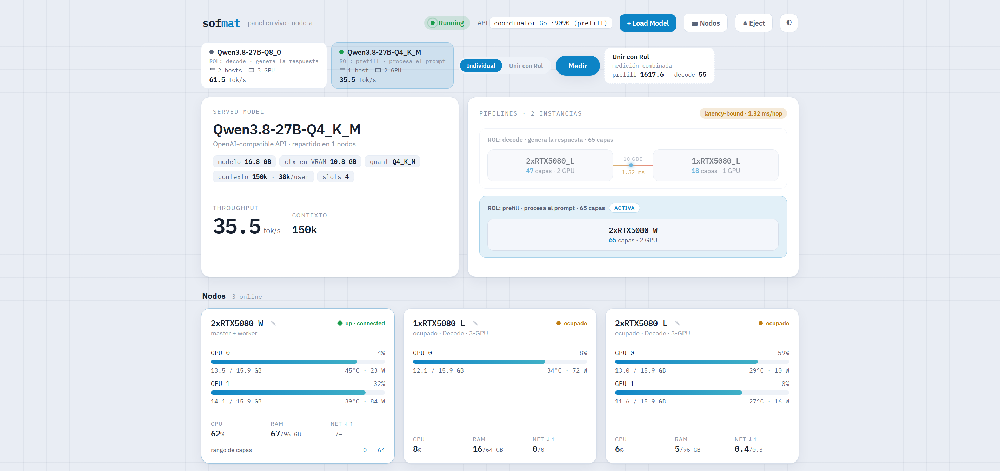
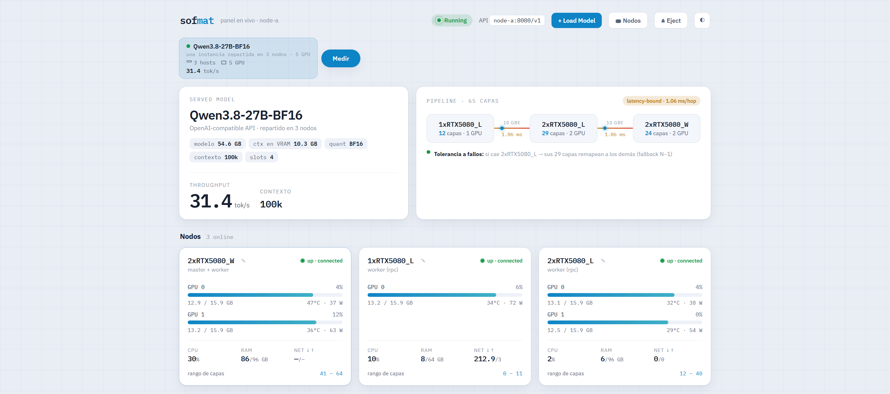
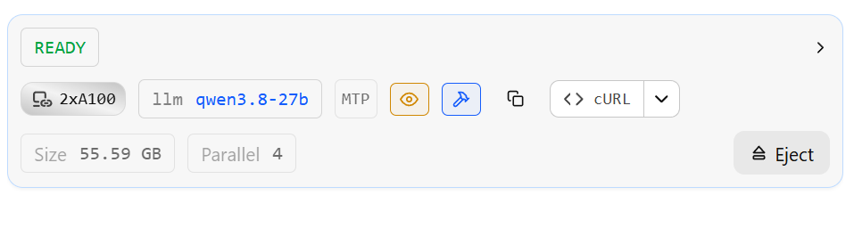

# sofmat


**Pool the GPUs of several ordinary machines to serve one large model behind a single OpenAI-compatible API — over the plain 10 GbE Ethernet you already have.**

Point any OpenAI client at one endpoint; sofmat runs the model split across every GPU in your cluster. It's for models too big for a single machine, on consumer hardware and TCP — no InfiniBand, no RDMA.

> Early, built in the open. Apache-2.0.

## What it achieves today

A **27B** model at **Q8** precision with a **150k-token context**, served across **two nodes of consumer GPUs** (16 GB each) over standard **10 GbE**, at **~65 tokens/s** single-stream decode — with full **8/8 needle-in-a-haystack recall** at 150k.

<!-- panel screenshot (sanitized: anonymized node labels, no infra IPs) -->


And at **BF16** — full precision, maximum quality — the same **27B** runs with a **100k-token context** as a single instance spread across **three nodes / five GPUs**, still over plain **10 GbE**, at **~32 tokens/s** single-stream decode:

<!-- panel screenshot (sanitized: anonymized node labels, no infra IPs) -->


### How it compares

Same 55 GB BF16 model, same 100k context, same speculative decoding — measured head-to-head against **two datacenter A100s**:

| Setup | GPUs | Interconnect | Single-stream decode |
|---|---|---|---|
| 2× A100 | 2 × datacenter (160 GB HBM) | PCIe (no NVLink) | ~34 tok/s |
| **sofmat** | **5 × consumer RTX 5080, 3 nodes (80 GB GDDR7)** | **plain 10 GbE** | **~32 tok/s** |

Within ~5% — and neither setup uses a fancy interconnect: the A100s are on ordinary PCIe, sofmat is on plain 10 GbE Ethernet. Five consumer GPUs across three machines keep pace with a pair of A100s on this workload, at a fraction of the cost. (The A100s hold 2× the VRAM, so they pull ahead on concurrency and much larger contexts; for single-stream decode of a model this size, they're neck-and-neck.)

<!-- reference: the same 27B (qwen3.8-27b), same 55.59 GB, same MTP speculation, on 2× A100 -->


## What sofmat is (and isn't)

sofmat is the **orchestration layer**, not a new inference engine — the layer math is done by a proven engine (**llama.cpp**). sofmat is what drives it across a cluster and adds what a single engine doesn't do on its own: memory-bandwidth-aware partitioning, serve-the-model-once, elastic membership with failover, authenticated transport, disaggregated prefill/decode, and network-vs-compute instrumentation. On one node it's just llama.cpp; sofmat makes several mismatched machines act as one.

## The techniques that get the speed

Single-stream decode of a large model split across a network is **latency-bound by construction**: token *t+1* waits on *t*, and every token pays the per-hop round-trip. Going from a ~24 tok/s baseline to ~65 is a stack of orthogonal techniques, each **measured wall-clock**:

1. **Q8_0 weight quantization** — decode is memory-bandwidth-bound, so halving the bytes-per-weight (vs BF16) roughly doubles decode speed *and* frees the VRAM the model needs to breathe. Measured, matched settings: **BF16 34 → Q8 63 tok/s**; Q8 fits 150k context where BF16 barely reaches 100k.
2. **q4_0 KV-cache quantization + FlashAttention** — shrinks the key/value cache ~4×, which is what makes a **150k** context fit in the VRAM budget. Recall preserved (**8/8** at 150k).
3. **Speculative decoding via the model's integrated MTP draft head** (`--spec-type draft-mtp`) — the model's co-trained "next-n" head proposes tokens essentially for free (no separate draft model, no tokenizer mismatch), paying the per-hop latency once per *wave* instead of once per token: **×2.5–2.8** decode (**24 → 63 tok/s**), losslessly.
4. **Balanced tensor-split across GPUs** — layers weighted by each GPU's real load; the "main" GPU (which also holds the output head + sampler) gets a *lighter* share. A naïve even split saturated one GPU and ran **6 tok/s + OOM**; rebalancing took the same config to **34 tok/s (×5.7)**.
5. **Pipeline parallelism across hosts × tensor parallelism within a host** — pools VRAM so a model that fits in no single node runs across several. Only the per-token activation (~10 KB) crosses the wire, so plain 10 GbE is never the bottleneck — the GPU compute is.
6. **Continuous batching** — concurrent requests share the per-token verification compute; aggregate throughput scales with load and coexists with speculation.
7. **Disaggregated prefill/decode** — a long prompt's prefill runs on a *separate* node from the decode, so it can't stall in-flight generation. Measured: co-located, a concurrent 27k-token prefill degraded decode **×5.79** (32 → 5.6 tok/s); disaggregated, decode was **untouched (×0.99)**. This is the pattern Azure (Splitwise), Moonshot (Mooncake) and NVIDIA (Dynamo) run in production — reproduced here on consumer hardware.

Every figure is wall-clock (`completion_tokens / seconds`), never a speculation-confounded per-second field.

## Architecture — a single Go binary

sofmat's production stack is one **Go** binary spanning three planes, so there's one runtime, one build chain, one debug mode:

- **data-plane** — authenticated framed transport + bulk KV handoff (`internal/transport`, `internal/kvhandoff`)
- **control-plane** — admission, routing / hash-ring, and the role/replica solver (`internal/gateway`, `internal/partitioner`)
- **engine** — a cgo binding to `libllama` for KV extract/inject (`internal/engine`)

orchestrated by `internal/coordinator`, which fronts the OpenAI-compatible API. The model weights are never touched by sofmat — everything here is orchestration.

## Quickstart

```bash
git clone https://github.com/Custok/sofmat.git && cd sofmat
go build ./... && go vet ./... && go test ./...      # pure-Go planes, no deps
```

No Go on your box? Run the toolchain in a container (no host install):

```bash
docker run --rm -v "$PWD":/src -w /src golang:1.22-alpine \
  sh -c "go build ./... && go vet ./... && go test ./..."
```

A real multi-GPU run: copy `config.example.json` → `config.local.json` (git-ignored), describe your cluster, and see [`docs/design/`](docs/design/). The engine binding needs `libllama` (cgo).

## Repository layout

```
cmd/sofmat/            CLI entrypoint (sofmat serve)
internal/transport/    inter-host framed transport + bulk KV handoff (auth, sha256, TCP)
internal/kvhandoff/    prefill->decode KV handoff protocol
internal/partitioner/  heterogeneous role/replica/layer solver (memory-bandwidth aware)
internal/gateway/      admission + routing (prefix-cache, disaggregation, fail-soft)
internal/engine/       cgo binding to libllama (state_seq_get/set)
internal/coordinator/  the serve loop: wires the planes behind the OpenAI API
docs/design/           specs (Go stack, KV handoff, low-latency, scheduler)
config.example.json    copy to config.local.json (git-ignored) and describe your cluster
```

## Design principles

- **Config-driven, infra-agnostic.** You describe *your* cluster; nothing about any deployment is baked in. Real endpoints live only in `config.local.*` (git-ignored); the repo uses anonymous node labels.
- **Security first (OWASP Top 10).** Authenticated transport, binary wire framing (**never `pickle`** — deserializing untrusted data over a socket is remote code execution), strict validation before anything touches the GPU. A leak-guard scanner + anti-deserialization gate runs pre-commit and in CI.
- **Measure before you build.** Every speed claim above is a wall-clock measurement on real hardware, not an estimate.

## Status

The distributed-systems core (transport, KV handoff, solver, gateway) is built and tested in Go; the coordinator wires them behind the API. The cgo engine binding is what lights up real multi-GPU inference. `go test ./...` is the gate.
